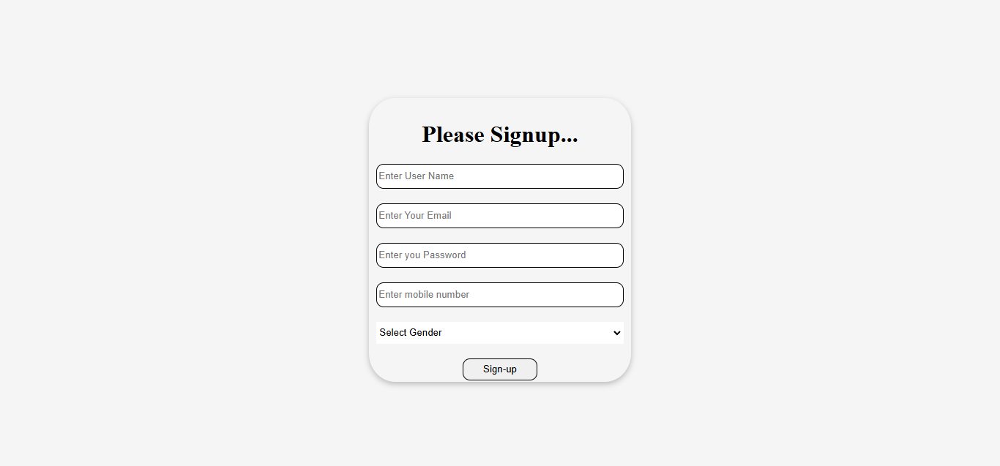
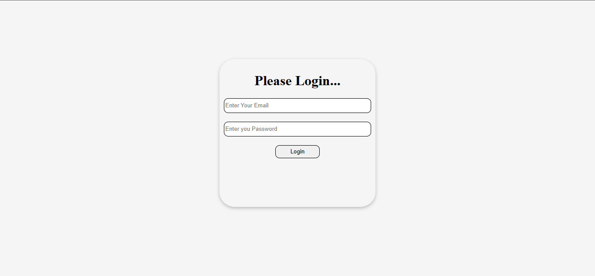
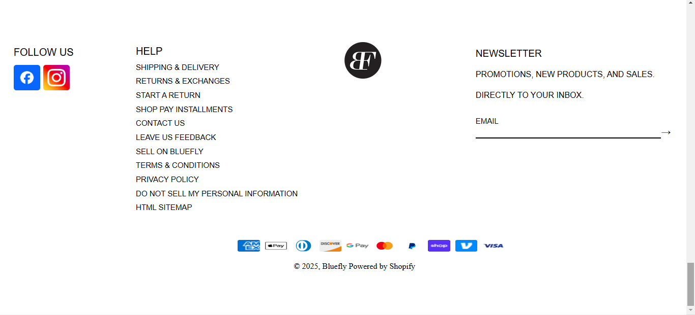

BLUEFLY.COM

Introduction

Bluefly is an online retailer that specializes in offering luxury fashion and designer 
products at discounted prices. Founded in 1998, the website is known for providing a 
curated selection of high-end clothing, shoes, handbags, accessories, and more from 
renowned fashion brands. Bluefly caters to fashion-forward shoppers who want premium 
quality without the steep price tag. The platform features a wide range of categories, 
including men's, women's, and children's apparel, with an emphasis on both timeless 
classics and the latest trends. It offers seasonal sales, clearance items, and exclusive 
deals, making luxury fashion more accessible to a broader audience. With a user-friendly 
interface, secure shopping experience, and customer-centric policies, 
Bluefly remains a popular destination for online shoppers seeking quality and style.

💻 Tech Stack:

PROJECT TYPE

Frontend | Backend | Fullstack

DEPLOYED LINK:

Frontend -

DIRECTORY STRUCTURE

my-signin-app -> Backend -> frontend -> ||

VIDEO WALKTHROUGH OF THE PROJECT 

![src]

FEATURES 

Wide Range of Categories : Bluefly offers an extensive selection of profucts across various categories, including women's,men's and children's fashion, as well as handbags,shoes and accessories.

User-Friendly Shopping Experience : With easy navigation, detailed product descriptions, 

Soring and Filtering the products are category wise

SCREENSHOTS 

